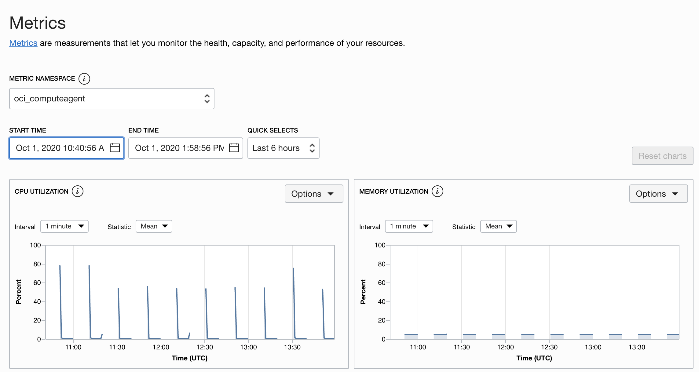

# OCI Scheduling (The Hard Way)

Save some money when you don't need resources out of business hours by automatically schedule starting and stopping the resources.

Learn some of the features of the Oracle Cloud Infrastructure (OCI) Command Line Interface (CLI) examples.


> USE THIS PROJECT AT YOUR OWN RISK
>
> THE SOFTWARE IS PROVIDED "AS IS", WITHOUT WARRANTY OF ANY KIND, EXPRESS OR IMPLIED, INCLUDING BUT NOT LIMITED TO THE WARRANTIES OF MERCHANTABILITY, FITNESS FOR A PARTICULAR PURPOSE, TITLE AND NON-INFRINGEMENT. IN NO EVENT SHALL THE COPYRIGHT HOLDERS OR ANYONE DISTRIBUTING THE SOFTWARE BE LIABLE FOR ANY DAMAGES OR OTHER LIABILITY, WHETHER IN CONTRACT, TORT OR OTHERWISE, ARISING FROM, OUT OF OR IN CONNECTION WITH THE SOFTWARE OR THE USE OR OTHER DEALINGS IN THE SOFTWARE.

## Create the virtual machine to be scheduled

> For testing, use the smallest shape possible to play around

Take note of the compartment `OCID` the instance is being created in.

> You can find compartments and the `OCID` on `Menu > Identity > Compartments` on the Oracle Cloud web console.

Let's call the machine `puppet`.

## Get familiar with OCI Command Line Interface

Oracle Cloud Infrastructure [Cloud Shell](https://docs.cloud.oracle.com/en-us/iaas/Content/API/Concepts/cloudshellintro.htm) is a web browser-based terminal accessible from the Oracle Cloud Console.

Cloud Shell is free to use, and provides access to a Linux shell, with a pre-authenticated Oracle Cloud Infrastructure CLI, a pre-authenticated Ansible installation, and other useful tools for following Oracle Cloud Infrastructure service tutorials and labs.

Cloud Shell is a feature available to all OCI users, accessible from the Console.

Your Cloud Shell will appear in the Oracle Cloud Console as a persistent frame of the Console, and will stay active as you navigate to different pages of the Console.

Create a VM that we are going to use for testing the scheduling.

Open `Cloud Shell` and wait for the instantiation:


Export a variable `C` with the compartment OCID value:

```bash
export C=<compartment_OCID>
```

List your instances in the compartment and filter relevant information with `jq`:

```bash
oci compute instance list -c $C | jq '.data[] | {ocid: .id, name: ."display-name", status: ."lifecycle-state"}'
```

Export variable `PUPPET_INSTANCE` with instance OCID:

```bash
export PUPPET_INSTANCE=<instance_ocid>
```

Ask the instance to stop, nicely:

```bash
oci compute instance action --action SOFTSTOP --instance-id $PUPPET_INSTANCE
```

As part of scripting for DevOps, it is nice if we wait for the action to be performed.

To Start the instance and wait for the action to be completed:

```bash
oci compute instance action --action START --wait-for-state RUNNING --instance-id $PUPPET_INSTANCE
```

## Create a IAM user

Create a IAM user called `hand`

Go to `Menu > Identity > Users` and click `Create User`. Select `IAM User`.

Copy the Oracle Cloud Identifier (OCID) of the new user, it should look something like this:

`ocid1.user.oc1..aaaaaaaax5lzqijkcilif5dxhuf3bsghpgsdm4eksqg4fpqhej523hswqxta`

## Create the VM to schedule resources

Once again, create a new virtual machine. This time we are going to call it `hand`.

> Pick the smallest shape as the workload is going to be minimal

SSH into the machine

```bash
ssh opc@<public_ip>
```

Install the OCI CLI (Oracle Linux 8)

```bash
bash -c "$(curl -L https://raw.githubusercontent.com/oracle/oci-cli/master/scripts/install/install.sh)"
```

> For other versions and more info, visit [OCI CLI installation](https://docs.cloud.oracle.com/en-us/iaas/Content/API/SDKDocs/cliinstall.htm)

Select all the default values, press [ENTER] to do so.

Confirm everything works by printing the version of the CLI tool

```bash
oci -v
```

### Configure OCI CLI

You can follow the steps in [Setting up the Config File](https://docs.cloud.oracle.com/en-us/iaas/Content/API/SDKDocs/cliinstall.htm#configfile)

```bash
oci setup config
```

> To retrieve the values [Where to Get the Tenancy's OCID and User's OCID](https://docs.cloud.oracle.com/en-us/iaas/Content/API/Concepts/apisigningkey.htm#five)

Press `ENTER` on `Enter a location for your config [/home/opc/.oci/config]:`

Set the User `OCID` on `Enter a user OCID:`

Set the Tenancy `OCID` on `Enter a tenancy OCID:`

Set the Region `name` on `Enter a region (e.g. ...`. I use `uk-london-1` but pick yours.

Answer `Y` to `Do you want to generate a new API Signing RSA key pair? (If you decline you will be asked to supply the path to an existing key.) [Y/n]:`

Press `ENTER` on `Enter a directory for your keys to be created [/home/opc/.oci]:`

Press `ENTER` on `Enter a name for your key [oci_api_key]:`

Press `ENTER` on `Enter a passphrase for your private key (empty for no passphrase):`

There will print the configuration path, fingerprint and keys path:

```
Public key written to: /home/opc/.oci/oci_api_key_public.pem
Enter a passphrase for your private key (empty for no passphrase):
Private key written to: /home/opc/.oci/oci_api_key.pem
Fingerprint: aa:bb:cc:dd:ee:ff:00:11:22:33:44:55:66:77:88:99
Config written to /home/opc/.oci/config
```

Get the content of your public key:

> Copy all the content, make sure you don't copy any ghost character

```bash
cat /home/opc/.oci/oci_api_key_public.pem
```

Copy the public key and go to your Oracle Cloud user settings on `Menu > Identity > Users > <your_user>`.

Then in the small menu on the bottom-left on `API Keys`

Click Add Public Key and `PASTE PUBLIC KEYS`, then paste the content of your public key

Confirm the fingerprint match the one created with `oci setup keys`.

Come back to the SSH terminal and confirm by requesting the namespace of Object Storage service:

```bash
oci os ns get
```

You should get a response in JSON format.

### Scheduling with cron

Create a bash script for starting the resource:

```bash
vim start_instance.sh
```

With the following script"

```bash
#!/bin/bash
PUPPET_INSTANCE=<ocid_of_your_instance>
echo "Starting instance..."
oci compute instance action --action START --wait-for-state RUNNING --instance-id $PUPPET_INSTANCE
```

Create a bash script for stopping the resource:

```bash
vim stop_instance.sh
```

With the following script

```bash
#!/bin/bash
PUPPET_INSTANCE=<ocid_of_your_instance>
echo "Stopping instance..."
oci compute instance action --action SOFTSTOP --instance-id $PUPPET_INSTANCE
```

```bash
chmod u+x start_instance.sh
```

```bash
chmod u+x stop_instance.sh
```

### Grant IAM user permissions to start and stop instances

If you run the scripts at the moment they will fail with 404 `NotAuthorizedOrNotFound`

Your IAM user `hand` doesn't have permissionts to manage compute instances in your compartment.

Create a group `hand-group` and add `hand` user to it

Create a policy with:

`Allow group hand-group to manage instance-family in compartment <compartment_ocid>`

### Create a cron tab entry

Create a `cron` tab for the schedule time.

```bash
crontab -e
```

```bash
PATH=/home/opc/bin:$PATH
0,20,40 * * * * /home/opc/stop_instance.sh >> /home/opc/stop.log 2>&1
10,30,50 * * * * /home/opc/start_instance.sh >> /home/opc/start.log 2>&1
```

> Remember to change the paths if you use other user or Linux distribution

Schedule a cron to execute on every 10 minutes
List the crontab

```bash
crontab -l
```

After the scheduling happens you can see the logs of `cron` by reading `/var/log/cron`.

```bash
tail /var/log/cron
```

> You might need sudo to have access to `var/log/cron`

You should see something like this after half an hour or so:

```
Sep 30 11:20:01 hand CROND[15369]: (opc) CMD (/bin/sh stop_instance.sh)
Sep 30 11:30:01 hand CROND[17576]: (opc) CMD (/bin/sh start_instance.sh)
Sep 30 11:40:01 hand CROND[19820]: (opc) CMD (/bin/sh stop_instance.sh)
```

You will also have `start.log` and `stop.log` log files on `/home/opc`.

### Check the results

You can wait on the details page of the instance and see how the instance is coming up and down every 10 minutes.

Check the metrics as well, they should look something like this:



### Useful crontab entries

Execute at 2am daily

`0 2 * * * /home/user/job.sh`

Execute twice a day

`0 4,16 * * * /home/user/job.sh`

Execute on every minute

`* * * * * /home/user/job.sh`

Execute on every Sunday at 10 PM

`0 22 * * sun /home/user/job.sh`

Execute on every 10 minutes

`*/10 * * * * /home/user/job.sh`

## Watch out

This is just a simple example to make you familiar with OCI, in a production environment you should look out for:

- **High Availability**, what happens when the `hand` fail?
- **Observability**, do I know if the `hand` fails to perform an action?
- Don't use public IPs directly with SSH, better to use a **bastion host**
- Configure `oci` with a user that only have **permissions** to work on a compartment and do the actions that you need
